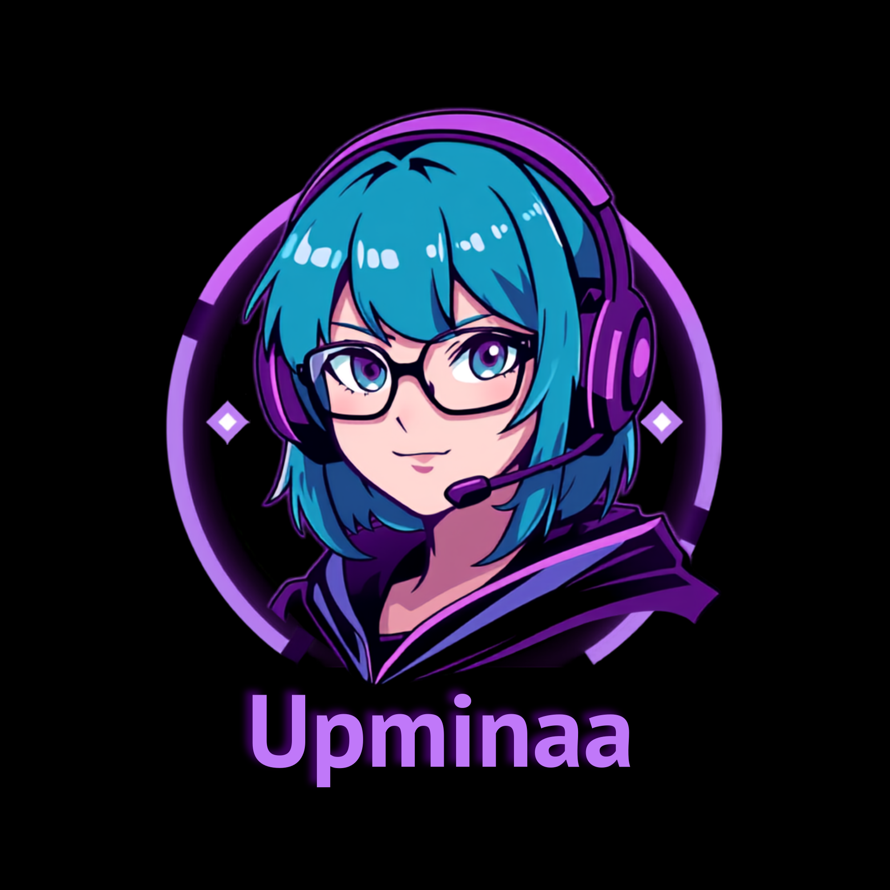

# 🌸 Upminaa Fan Hub



A fan-made website dedicated to **Upminaa**, bringing together public information, cosplays, gallery, streams, videos and official links into one organized platform.

This project was developed as a front-end study and portfolio project, focused on modern web development, content organization, SEO optimization and creating a visually immersive experience for fans.

---

# 🌎 Live Website

Visit the deployed version:

https://1anxtz.github.io/upminaa-fansite/

---

# ✨ Features

## 🏠 Home / Hero Section

- Fan Hub introduction
- Main creator image
- LIVE status indicator
- Quick navigation between sections
- Modern neon-inspired design

---

## 👤 About

- Creator information
- Profile cards
- Custom biography section
- Organized layout with image and content

---

## 🎭 Cosplays

- Featured cosplay section
- Individual cosplay cards
- Character descriptions
- Optimized image presentation
- Full-size image preview with custom lightbox

---

## 🖼️ Gallery

- Collection of moments
- Behind-the-scenes content
- Community fanart
- Artist credits
- Expanded image viewing

---

## 📺 Media

- Twitch live stream section
- YouTube video area
- Official platform links
- Structure prepared for future integrations

---

## 🌐 Community

Official social media links:

- Instagram
- TikTok
- Twitch
- YouTube
- X/Twitter

---

# 🔍 User Experience

- Modern neon interface
- Smooth animations
- Hover effects
- Custom lightbox system
- Responsive design for desktop and mobile
- Smooth scrolling navigation

---

# 🛠️ Technologies Used

## Front-end

- HTML5
- CSS3
- JavaScript Vanilla

---

## Development Features

- CSS Grid
- CSS Flexbox
- Intersection Observer API
- DOM Manipulation
- Responsive Design
- Smooth Scroll
- Custom UI components

---

## SEO & Web Optimization

- SEO metadata optimization
- Google Search Console integration
- XML Sitemap
- Robots.txt configuration
- Schema.org Structured Data
- Open Graph integration
- Twitter Cards

---

# 📂 Project Structure

```text
upminaa-fansite/

│
├── index.html
├── style.css
├── main.js
├── README.md
├── LICENSE
├── robots.txt
├── sitemap.xml
│
└── images/
    │
    ├── favicon.png
    │
    ├── profile/
    │   ├── upminaa-profile.png
    │   └── upminaa-bio-photo.jpg
    │
    ├── cosplay/
    │   ├── cosplay-gura.jpg
    │   ├── cosplay-miku-br.jpg
    │   ├── cosplay-frieren.jpg
    │   ├── cosplay-marin.jpg
    │   ├── cosplay-miku-nakano.jpg
    │   └── cosplay-nino.jpg
    │
    └── gallery/
        ├── main.jpg
        ├── behind-the-scenes.jpg
        ├── fanart.jpg
        └── gaming.jpg
```

---

# 🚀 How To Run

Clone the repository:

```bash
git clone https://github.com/1ANXTZ/upminaa-fansite.git
```

Enter the project folder:

```bash
cd upminaa-fansite
```

Open:

```text
index.html
```

or use an extension like **Live Server** in VS Code.

---

# 🌎 Deployment

Current deployment:

- GitHub Pages

Future deployment compatibility:

- Netlify
- Vercel

---

# 📊 Project Status

🚀 Live project

Website:

https://1anxtz.github.io/upminaa-fansite/

This project was created as a front-end portfolio project using HTML, CSS and JavaScript.

---

# 🎨 Credits

## Development

Created by:

**1ANXTZ (Ian)**

GitHub:

https://github.com/1ANXTZ

Instagram:

https://instagram.com/1anxtz

---

## Fanart

Artwork used in the gallery:

Artist:

**@someguywhoarts**

Instagram:

https://instagram.com/someguywhoarts

---

# 📌 Disclaimer

This project is an unofficial fan project created to organize and present publicly available information related to Upminaa.

It is not affiliated with, sponsored by, endorsed by or officially connected to Upminaa.

All images, artworks, logos and trademarks belong to their respective owners.

---

# 🔮 Future Improvements

Possible future updates:

- Official Twitch API integration for automatic LIVE status
- Automatic YouTube content updates
- News and updates section
- Accessibility improvements
- Performance optimization
- New community interaction features

---

# 📄 License

This project is licensed under the MIT License.

See the `LICENSE` file for more information.
